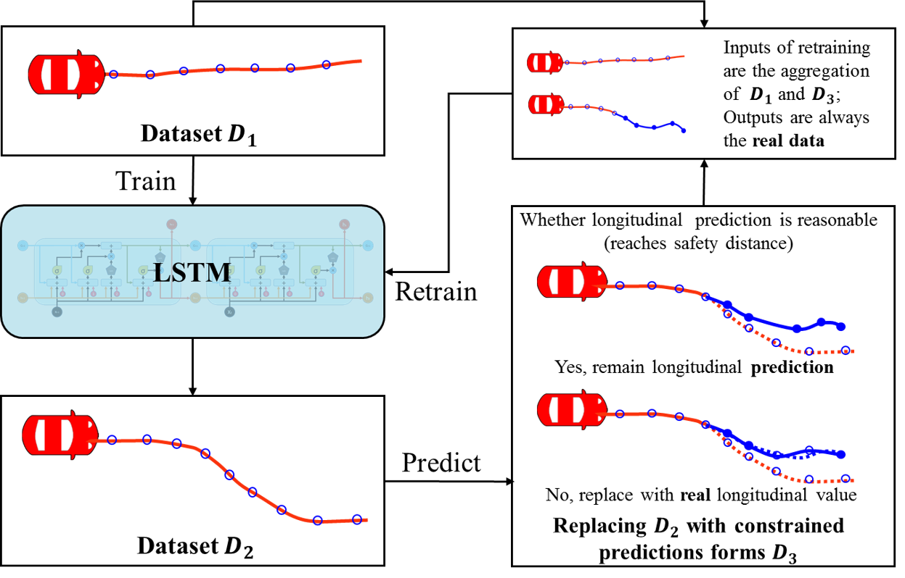
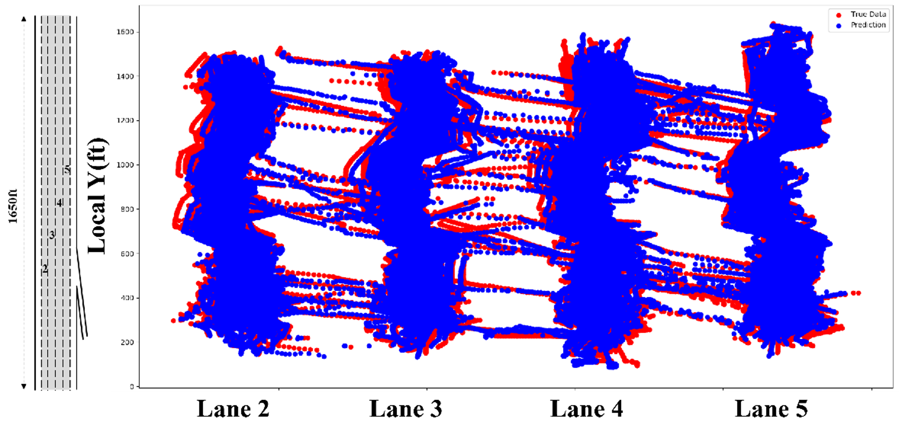
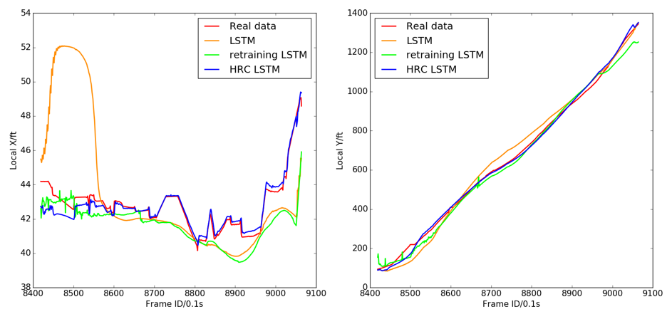
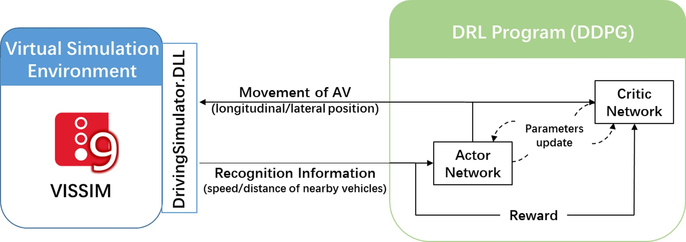
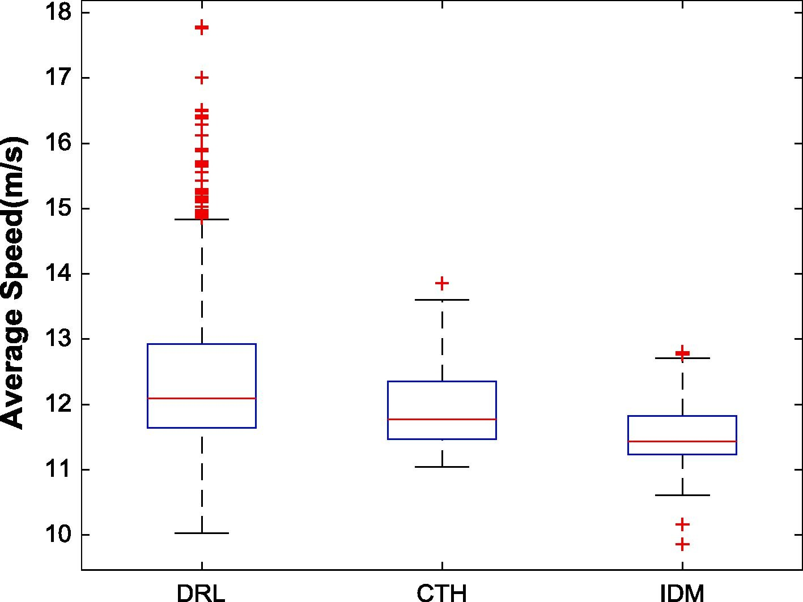
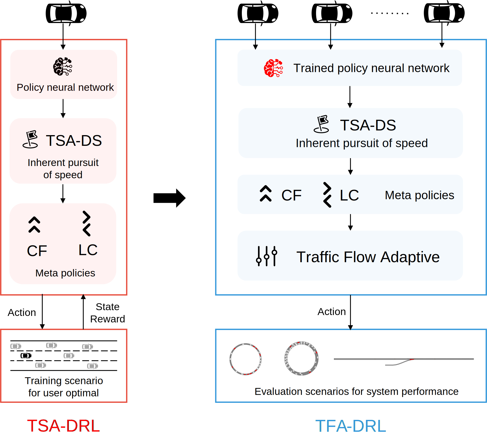
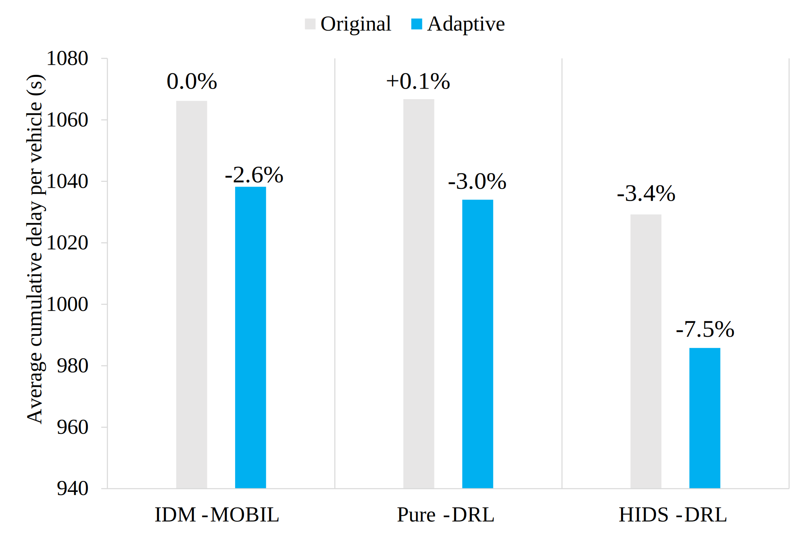

My research applies advanced artificial intelligence to revolutionize autonomous vehicle behavior and decision-making in transportation systems. The central challenge I address is that traditional approaches treat driving behaviors as isolated processes, failing to capture the interconnected nature of real-world traffic dynamics. Through deep learning and reinforcement learning techniques, I develop AI systems that understand and replicate the integrated, adaptive decision-making that characterizes skilled human driving.

<h3> Integrated Behavior Modeling Through Deep Learning</h3>

I have developed Long Short-Term Memory neural networks that simultaneously model car-following and lane-changing behaviors by observing only the positions of surrounding vehicles. This represents a fundamental shift from conventional approaches that model these behaviors separately. The LSTM architecture automatically extracts relevant features and captures the temporal dynamics of traffic interactions, while my Hybrid Retraining Constrained training method further optimizes performance. Validation with real-world trajectory data demonstrates superior accuracy compared to classical models and excellent transferability across different traffic environments.

<h3> Reinforcement Learning for Decision-Making</h3>

While autonomous vehicle perception has advanced rapidly, decision-making capabilities remain underdeveloped. I address this through a comprehensive framework combining deep reinforcement learning with high-fidelity simulation environments. This enables autonomous vehicles to learn optimal decision strategies that achieve nearly eight percent efficiency improvements over established adaptive cruise control systems while maintaining safety and comfort. Extending to complex multi-lane scenarios, my integrated models achieve additional performance gains by coordinating longitudinal and lateral movements as unified decision processes.

<h3> Hierarchical AI Integration</h3>

Recognizing the need for both learning capability and interpretability in safety-critical applications, I have developed hierarchical frameworks that strategically combine reinforcement learning with rule-based methods. Through the concept of Instantaneous Desired Speed as an intermediate action, high-level AI algorithms focus on strategic decisions while low-level systems handle tactical execution. This approach maintains the adaptability of machine learning while preserving the transparency of traditional control systems. 

My Traffic Flow Adaptive strategy extends this hierarchical approach to system-level optimization, enabling individually controlled autonomous vehicles to coordinate for improved overall traffic flow. This shift from isolated decision-making to collaborative traffic participation represents a crucial advancement toward practical autonomous vehicle deployment.

<h3> Research Impact</h3>

Through rigorous validation using real-world data and comprehensive benchmarking, my research demonstrates that artificial intelligence can create autonomous driving systems that are both more human-like and more efficient than existing approaches. By developing models that integrate multiple driving behaviors, learn from experience, and maintain interpretability, I am establishing the foundation for autonomous vehicles that can operate effectively in mixed traffic environments alongside human drivers. This work contributes directly to the vision of intelligent transportation systems where AI-enabled vehicles enhance both individual mobility and overall traffic system performance.

<h3> References</h3>

<cite> 
<ul>
<li><b>Zhang, X.</b>, Sun, Jie, Qi, X., Sun, Jian, 2019. Simultaneous modeling of car-following and lane-changing behaviors using deep learning. Transportation Research Part C: Emerging Technologies 104, 287–304.</li>  
<li>Ye, Y.*, <b>Zhang, X.</b>*, Sun, J., 2019. Automated vehicle’s behavior decision making using deep reinforcement learning and high-fidelity simulation environment. Transportation Research Part C: Emerging Technologies 107, 155–170.</li>
<li><b>Zhang, X.</b>, Sun, Jie, Wang, Y., Sun, Jian, 2023. A Hierarchical Framework for Multi-Lane Autonomous Driving Based on Reinforcement Learning. IEEE Open Journal of Intelligent Transportation Systems 4, 626–638.</li></ul> 
</cite>

<!-- PyTorch is a Python package that provides tensor computation (like NumPy) with strong GPU acceleration. -->

<!--more-->
