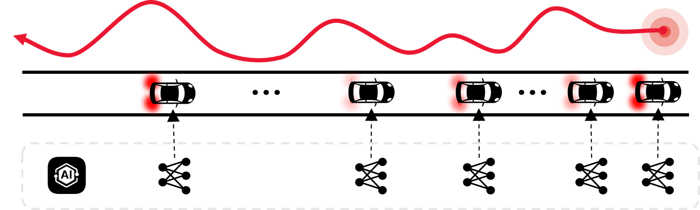

Understanding the impacts of autonomous vehicles (AVs) on traffic requires bridging the gap between vehicle-level behaviors and system-level outcomes. My research approaches this challenge through two complementary studies: the stability of AV car-following dynamics and the fundamental diagram of mixed traffic flow.

<h3> String stability analysis of NN-based car-following model</h3>

The first line of work addresses <b>string stability</b>. Stability is critical because even minor fluctuations in car-following behavior can propagate and amplify, creating stop-and-go waves that degrade traffic efficiency. While traditional analytical models have been widely studied, no theoretical framework existed for analyzing the string stability of neural network–based car-following models, which are increasingly used to capture realistic AV behavior. 

To fill this gap, I developed the EADC framework (Estimation–Approximation–Derivation–Calculation), which derives stability criteria for both feedforward and recurrent neural network models. Validated on representative NN-based models, the framework demonstrates consistency between theoretical and simulation results, establishing the first rigorous method for assessing the stability of AI-driven vehicle behavior.

<h3> Stochastic Fundamental Diagram modeling for mixed traffic</h3>

The second line of work focuses on the <b>Stochastic Fundamental Diagram (SFD) for mixed traffic</b>. Current AV impact studies often oversimplify traffic dynamics or ignore stochasticity, limiting their realism. To overcome this, I proposed a data-driven probabilistic modeling framework that learns car-following interactions for all leader–follower types (AV–AV, AV–HV, HV–AV, HV–HV) using mixture density networks. By modeling platoons as Markov chains, the framework derives the SFD from trajectory data, validated against NGSIM and Waymo datasets. Results show that higher AV penetration decreases mean capacity and critical density while reducing capacity uncertainty, highlighting the conservative yet stabilizing effects of current AVs.

<h3> Research Impact</h3>

Together, these studies reveal how AVs influence traffic from the perspective of stability and capacity: string stability analysis ensures the reliability of AI-based AV behavior, while SFD modeling quantifies the systemic effects of AV penetration. My contributions establish new theoretical and data-driven foundations for assessing AV impacts, with implications for both traffic management strategies and policy-making in the era of mixed traffic.

<h3> References</h3>

<cite> 
<ul>
<li><b>Zhang, X.</b>, Sun, Jie, Zheng, Z., Sun, Jian, 2024. On the string stability of neural network-based car-following models: A generic analysis framework. Transportation Research Part C: Emerging Technologies 160, 104525.</li> 
<li><b>Zhang, X.</b>, Yang, K., Sun, Jie, Sun, Jian, 2025. Stochastic fundamental diagram modeling of mixed traffic flow: A data-driven approach. Transportation Research Part C: Emerging Technologies 179, 105279.</li>
</ul>
</cite>

<!-- Flexible and powerful data analysis / manipulation library for Python, providing labeled data structures. -->

<!--more-->
